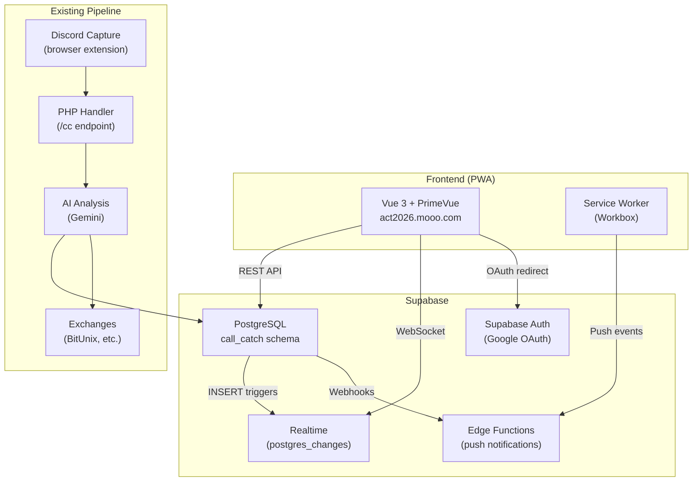

# UI App — Architecture

## Overview

The ACT Trading UI is a **PrimeVue PWA** served at `https://act2026.mooo.com`. It provides a real-time dashboard for monitoring the algorithmic trading pipeline — Discord trade calls, AI analysis, and order execution.

A separate **Flutter Android app** (`ui_app/flutter/`) is planned for Phase 5.

## System Diagram



## Tech Stack

| Layer | Technology | Purpose |
|-------|-----------|---------|
| Framework | Vue 3 + TypeScript | Reactive UI with type safety |
| Build | Vite 8 | Dev server + production bundling |
| UI Library | PrimeVue 4 (Aura dark) | Pre-built components + dark theme |
| Auth | Supabase Auth | Google OAuth, session management |
| Data | `@supabase/supabase-js` | REST queries + Realtime subscriptions |
| PWA | `vite-plugin-pwa` (Workbox) | Service worker, manifest, offline |
| Hosting | Nginx + Let's Encrypt | Static files, HTTPS, SPA routing |

## Data Flow

### Authentication
```
User → Login Page → supabase.auth.signInWithOAuth('google')
  → Supabase redirects to Google
  → Google redirects back to Supabase callback
  → Supabase sets JWT session cookie
  → PWA reads session, routes to Dashboard
```

### Notification Feed (Real-time)
```
Discord message → PHP handler → AI → INSERT into discord_messages
  → Supabase Realtime detects INSERT
  → WebSocket pushes change to PWA
  → NotificationFeed prepends new card (animated)
```

### Push Notifications (planned)
```
INSERT into trade_actions
  → Database webhook → Edge Function
  → Edge Function reads push_subscriptions
  → Web Push API sends notification to device
```

## Database Schema (call_catch)

The PWA reads from three existing tables:

| Table | Key Columns | Purpose |
|-------|------------|---------|
| `discord_messages` | `message_id`, `author`, `channel_name`, `text_content`, `received_at` | Captured trade calls |
| `ai_log` | `discord_message_id`, `system_prompt`, `user_prompt`, `ai_response` | AI analysis results |
| `trade_actions` | `discord_message_id`, `action`, `exchange`, `symbol`, `side`, `price`, `qty`, `order_id` | Executed trade orders |

### RLS Policies

All tables have Row Level Security enabled with `SELECT` for `authenticated` role. This means only users signed in via Supabase Auth can read data.

### Future: user_exchange_accounts

Per-user exchange API keys (encrypted via Supabase Vault / `pgsodium`) will be added in Phase 2+ when the Position Helper feature is built.

## Directory Layout

```
ui_app/
├── pwa/                            ← PWA (Phase 1)
│   ├── src/
│   │   ├── lib/supabase.ts         ← Supabase client singleton
│   │   ├── composables/useAuth.ts  ← Auth composable (reactive)
│   │   ├── router.ts               ← Routes + auth guard
│   │   ├── layouts/DashboardLayout.vue
│   │   ├── views/
│   │   │   ├── LoginPage.vue
│   │   │   ├── NotificationFeed.vue
│   │   │   └── PlaceholderView.vue
│   │   ├── main.ts
│   │   └── style.css
│   ├── public/                      ← Static assets + PWA icons
│   ├── .env                         ← Supabase URL + anon key
│   └── vite.config.ts
└── flutter/                         ← Android app (Phase 5)
```

## Phases

| Phase | Feature | Status |
|-------|---------|--------|
| 1 | Auth + Notification Feed + Hosting | ✅ Deployed |
| 2 | Positions Display (exchange data) | Planned |
| 3 | Position Helper (order controls) | Planned |
| 4 | Backtesting UI | Planned |
| 5 | Flutter Android App | Planned |
